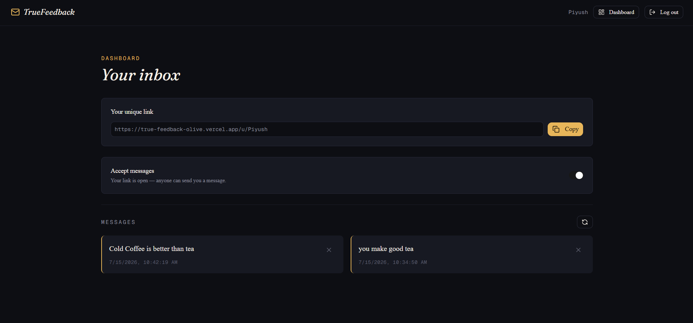

# TrueFeedback

TrueFeedback is an anonymous feedback platform built with **Next.js 15**, **TypeScript**, **MongoDB**, **NextAuth**, and **Tailwind CSS**. Every user gets a unique public link where anyone can send them honest, anonymous feedback — no account, no sign-in, and no way to trace the message back to its sender.

---



## Features

### Authentication
- Credentials-based sign up (username, email, password)
- Real-time username availability check (debounced)
- Email verification via a one-time code sent through **Resend**
- Accounts stay unverified (and can't log in) until the code is confirmed
- JWT-based sessions via **NextAuth**

### Anonymous feedback
Every user has a public link:

```
https://your-domain.com/u/username
```

Anyone with the link can open it — including in incognito — and send a message with no account, username, or email required. The receiver only ever sees the message content and a timestamp; the sender's identity is never captured or stored.

### Dashboard
After logging in, users can:
- View all feedback they've received, most recent first
- Delete individual messages
- Copy their public feedback link
- Toggle whether they're currently accepting new messages

### Accept-messages toggle
- **On** — anyone with the link can submit feedback
- **Off** — the public page shows a "not accepting messages" state and the API rejects new submissions with a 403

### AI-assisted message suggestions
On the public feedback page, senders can request AI-generated message suggestions (via Gemini) if they're not sure what to write, and click one to prefill the form.

---

## Tech stack

**Frontend**
- Next.js 15 (App Router)
- React
- TypeScript
- Tailwind CSS
- shadcn/ui components on top of [Base UI](https://base-ui.com) primitives (not Radix — see note below)

**Backend**
- Next.js Route Handlers
- MongoDB + Mongoose
- NextAuth (JWT strategy, Credentials provider)

**Validation**
- Zod
- React Hook Form

**Email**
- Resend

**AI**
- Gemini (message suggestions)

> **Note on UI primitives:** This project uses `@base-ui/react`, not Radix. Base UI's composition pattern uses a `render` prop instead of Radix's `asChild` — e.g. `<Button render={<Link href="/dashboard" />}>` instead of `<Button asChild><Link>...</Link></Button>`. Keep this in mind when adding new interactive components (dialogs, triggers, etc.).

---

## Design system

The UI follows an "anonymous inbox" visual identity — think unsigned notes landing in a mailbox rather than a generic SaaS dashboard.

| Token | Value | Use |
|---|---|---|
| Background (ink) | `#0D0E13` | Page background |
| Surface | `#171922` | Cards, panels |
| Border | `#262837` | Hairlines, dividers |
| Accent (wax seal) | `#E8B65A` | Primary actions, highlights |
| Text primary (paper) | `#F5EFE6` | Headings, body |
| Text muted | `#8B8D9E` | Secondary text |
| Text faint | `#5C5E6E` | Timestamps, eyebrows |

**Typography**
- `Fraunces` (italic) — display headings, gives a literary/confessional feel
- `Geist Sans` — body copy
- `Geist Mono` — eyebrows, timestamps, redacted sender lines (`FROM ●●●●●●●●`) — doubles as the "redacted document" texture

Message cards use a gold left border and slight alternating tilt to read as individually placed, unsigned notes rather than uniform list rows.

---

## Folder structure

```text
TRUEFEEDBACK
│
├── public/
│
├── src/
│   ├── app/
│   │   ├── (app)/
│   │   │   ├── dashboard/
│   │   │   │   ├── layout.tsx
│   │   │   │   └── page.tsx
│   │   │   ├── layout.tsx
│   │   │   └── page.tsx
│   │   │
│   │   ├── (auth)/
│   │   │   ├── sign-in/page.tsx
│   │   │   ├── sign-up/page.tsx
│   │   │   └── verify/[username]/page.tsx
│   │   │
│   │   ├── api/
│   │   │   ├── accept-messages/route.ts
│   │   │   ├── auth/[...nextauth]/
│   │   │   │   ├── options.ts
│   │   │   │   └── route.ts
│   │   │   ├── check-username-unique/route.ts
│   │   │   ├── delete-message/[messageid]/route.ts
│   │   │   ├── get-messages/route.ts
│   │   │   ├── send-messages/route.ts
│   │   │   ├── sign-up/route.ts
│   │   │   ├── suggest-messages/route.ts
│   │   │   └── verify-code/route.ts
│   │   │
│   │   ├── u/[username]/page.tsx
│   │   ├── favicon.ico
│   │   ├── globals.css
│   │   └── layout.tsx
│   │
│   ├── components/
│   │   ├── ui/
│   │   ├── MessageCard.tsx
│   │   └── Navbar.tsx
│   │
│   ├── context/AuthProvider.tsx
│   ├── emails/VerificationMail.tsx
│   ├── helpers/sendVerificationEmail.ts
│   ├── lib/
│   │   ├── dbConnect.ts
│   │   ├── resend.ts
│   │   └── utils.ts
│   ├── middleware/middleware.ts
│   ├── models/User.ts
│   ├── Schemas/
│   │   ├── acceptMessageSchema.ts
│   │   ├── messageSchema.ts
│   │   ├── signInSchema.ts
│   │   ├── signUpSchema.ts
│   │   └── verifySchema.ts
│   └── types/
│       ├── apiResponse.ts
│       └── next-auth.d.ts
│
├── messages.json
├── .env
├── package.json
└── next.config.ts
```

---

## Environment variables

Create a `.env` file in the project root:

```env
MONGODB_URI=

NEXTAUTH_SECRET=
NEXTAUTH_URL=http://localhost:3000

RESEND_API_KEY=
EMAIL_FROM=

GEMINI_API_KEY=
```

---

## Installation

```bash
git clone https://github.com/yourusername/truefeedback.git
cd truefeedback
npm install
npm run dev
```

Open [http://localhost:3000](http://localhost:3000).

---

## Known gotchas / lessons learned

A few non-obvious bugs came up during development that are worth knowing if you're extending this codebase:

- **Next.js 15 dynamic route params are async.** Any route handler using `{ params }` must type it as `Promise<{...}>` and `await` it — treating it as a plain object silently resolves to `undefined` fields.
- **Mongoose drops `undefined` values on update.** If a request body key doesn't match what the route destructures (e.g. client sends `acceptMessage`, server reads `acceptMessages`), the field is silently excluded from `$set` and the document never actually changes — no error is thrown.
- **`$unwind` drops documents with an empty array.** When aggregating a user's `messages` array, use `$unwind: { path: '$messages', preserveNullAndEmptyArrays: true }` — otherwise users with zero messages produce no aggregation result at all, which looks identical to "user not found."
- **Base UI's `Switch`/controlled inputs lock in controlled vs. uncontrolled on first render.** Always give `useForm` a `defaultValues` object so watched fields aren't `undefined` on mount — otherwise you'll get a "changing from uncontrolled to controlled" warning the moment data loads in asynchronously.
- **JWT sessions don't re-validate against the DB on every request.** If you reset or reseed your MongoDB `users` collection during local development, existing browser sessions can still reference a now-deleted `_id`. Sign out and back in after any DB reset.

---

## Future improvements

- Email notifications for new feedback
- Pagination and search/filter for messages
- Export feedback as PDF
- Public profile customization

---

## Author

**Piyush Kumar**

Built to learn and showcase full-stack development using the Next.js App Router ecosystem.